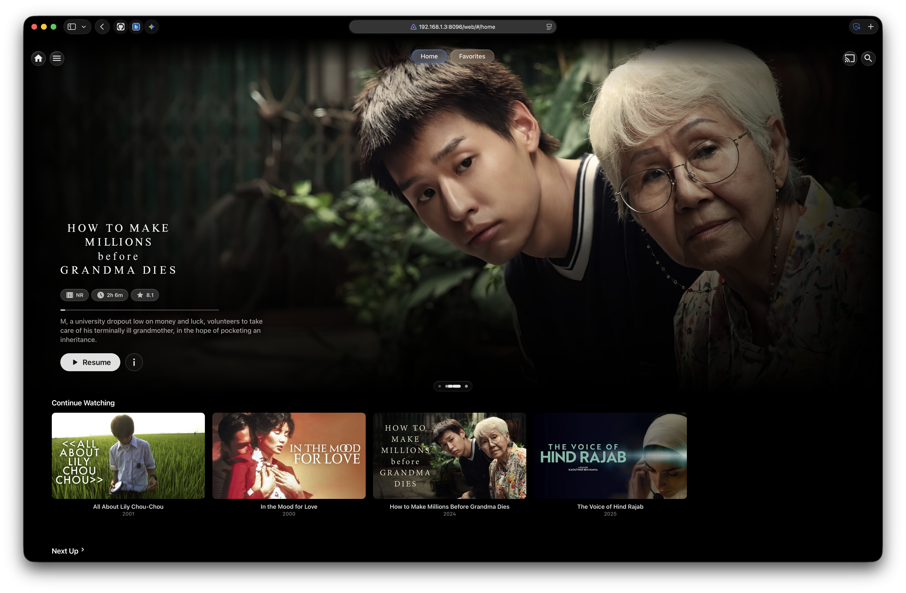
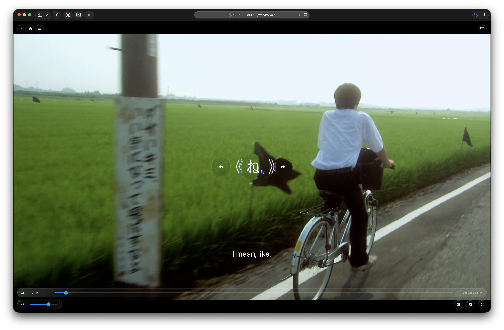

# Jellyfin Liquid Glass

A full-app theme for [Jellyfin](https://jellyfin.org) built around **Apple’s liquid-glass language** — translucent surfaces, live refraction, and a single Apple-blue accent — applied to the home screen, libraries, detail pages, settings, menus, **and** the video player.

The cinematic **home spotlight** is from **[Abyss](https://github.com/AumGupta/abyss-jellyfin)** (installed alongside this theme). The rest of the UI is this repo’s CSS + optional WebGL transport lenses.

<p align="center">
  
</p>

<p align="center"><em>Home — Abyss Spotlight banner over Liquid Glass chrome</em></p>

---

## Screenshots

### Home

Abyss **Spotlight** hero (Continue Watching / Next Up) with Liquid Glass header pills and rows underneath.


### Player

Centered transport with WebGL edge-refraction lenses; volume bottom-left; scrubber lifted; CC / settings / fullscreen bottom-right.



---

## Inspirations & credits

| Source | What we took | What we did not |
|--------|----------------|-----------------|
| **[Abyss](https://github.com/AumGupta/abyss-jellyfin)** by AumGupta | **Home Spotlight** — cinematic banner (backdrop, logo/title, rating/runtime/score pills, resume, carousel). Also the reason this CSS fights Abyss’s player prism / center-cluster halos (`#videoOsdPage` rings) so Liquid Glass transport can take over. | We do **not** ship Abyss’s full `abyss.css` as this theme. Spotlight is a separate install (`spotlight.html` / inject scripts in Jellyfin `web/ui`). |
| **Apple Liquid Glass / Vision Pro / Apple TV** | Translucent floating controls, near-clear glass, SF-first typography, Apple system blue (`#0a84ff`), poster cards, sidebar selection, iOS-style sliders. | Not an official Apple skin; no proprietary assets. |
| **[kube.io liquid glass (Maxime Bourgeois)](https://kube.io/blog/liquid-glass-css-svg/)** | Physics-based **SVG `feDisplacementMap`** for CSS glass: squircle profile → Snell–Descartes refraction → baked displacement map (`tools/generate-liquid-glass.py`). | We bake the map offline; we don’t run their playground live. |
| **[ybouane LiquidGlass](https://liquid-glass.ybouane.com)** | Player transport **look**: clear disc center, bend + **chromatic aberration** on the rim. | Implemented in our own WebGL shader (`tools/osd-lens-glass.js`). We do **not** embed that library. |

### How Abyss Spotlight fits

1. Abyss’s spotlight scripts inject an iframe (`web/ui/spotlight.html`) on the home view.
2. It reads Continue Watching / Next Up (and falls back to library items) and paints the hero.
3. This theme styles everything *around* it (header, drawer, rows, cards) with `--osd-pill-*` / global glass tokens so the page still feels like one product.
4. On the **player**, Abyss’s decorative rings are explicitly overridden so they don’t fight the WebGL lenses.

If you only want Liquid Glass CSS without Spotlight, skip the Abyss spotlight install — home will use Jellyfin’s normal sections.

---

## Features

- **One design language** — header, drawer, dialogs, action sheets, settings, forms, cards, and player share the same glass recipe and accent.
- **Abyss Spotlight home** (optional companion) — cinematic resume banner.
- **Live player glass** — CSS displacement on pills; **WebGL lenses** on rewind / play-pause / forward (rim refraction + chroma; green channel slightly desaturated in the fringe).
- **Graceful degrade** — disable Custom CSS in the client → stock buttons/menus. Lens JS only runs when `--liquid-glass-theme: on` is present. Opt out of lenses only: `liquidGlassLens.disable()` or `?nolens=1`.
- **Responsive** — desktop / tablet / mobile breakpoints for OSD and library UI.

---

## Installation

### 1. Theme CSS (required)

**Dashboard → General → Custom CSS** (server-wide), or paste into `branding.xml` `<CustomCss>`.

Copy all of [`style.css`](./style.css), save, then hard-refresh (`Ctrl+Shift+R`). Jellyfin often needs a **container restart** after branding changes.

### 2. WebGL transport lens (recommended)

Custom CSS is text inside a `<style>` tag — it cannot load scripts. Install the lens as a real file:

```bash
./tools/install-into-docker.sh
```

This writes branding CSS, copies `tools/osd-lens-glass.js` → `/usr/share/jellyfin/web/ui/`, links it from `index.html` with `?v=refraction-<hash>`, and installs a `custom-cont-init.d` persist hook.

**Manual:** copy `osd-lens-glass.js` into Jellyfin web `ui/` and add before `</body>`:

```html
<script src="ui/osd-lens-glass.js?v=refraction-1" defer></script>
```

### 3. Abyss Spotlight (optional, for the home hero)

Follow [Abyss setup](https://github.com/AumGupta/abyss-jellyfin/blob/main/SETUP.md) for the spotlight scripts (`spotlight.html`, `spotlight.css`, inject + home chunk patch), **or** use their installer. Keep Jellyfin’s display theme on **Dark**.

This repo assumes Spotlight is already on the server (as in the screenshots). Liquid Glass CSS is written to coexist with it.

---

## Requirements

- Jellyfin **10.9+** (web client)
- Browser with **`backdrop-filter`** (Chrome, Edge, Safari, Firefox 103+)
- WebGL for transport lenses (falls back to CSS frost if texture upload fails)

---

## Customization

Tokens live at the top of `style.css`:

```css
:root {
  --liquid-glass-theme: on;   /* sentinel for lens JS — do not remove if you use lenses */
  --accent-blue: #0a84ff;
  --blur: blur(22px) saturate(170%) brightness(102%);
  /* Player */
  --osd-transport-size: 5.6em;
  --osd-transport-large: 7.6em;
}
```

Lens look (edit `tools/osd-lens-glass.js`, then re-run the install script):

| Constant | Role |
|----------|------|
| `REFRACTION` | Rim bend strength |
| `CHROMA` | RGB split amount |
| `CHROMA_SAT` | How much fringe replaces the base |
| `CHROMA_GREEN_SAT` | Green-only desaturation in the fringe (`1` = full green) |

---

## Client opt-out

| Goal | How |
|------|-----|
| Stock Jellyfin UI | Settings → Display → **Disable server-provided custom CSS** |
| Keep theme, skip WebGL lenses | Console: `liquidGlassLens.disable()` / `.enable()`, or `localStorage.jellyfin-liquid-glass-lens = 'off'`, or `?nolens=1` |

---

## Repo layout

| Path | Role |
|------|------|
| `style.css` | Theme + OSD layout (CustomCss source of truth) |
| `tools/osd-lens-glass.js` | WebGL transport lens |
| `tools/install-into-docker.sh` | Branding + lens deploy + cache-bust |
| `tools/99-liquid-glass-lens.sh` | Cont-init persist hook |
| `tools/generate-liquid-glass.py` | Bake CSS displacement map (kube.io math) |
| `tools/capture-readme-shots.py` | Headless Chromium gallery capture |
| `info.md` | OSD hard rules & history |
| `docs/screenshots/` | README images |

---

## Capturing updated screenshots

With Jellyfin up and Chromium available:

```bash
chromium --headless=new --remote-debugging-port=9333 \
  --user-data-dir=/tmp/jf-shot --no-sandbox \
  --autoplay-policy=no-user-gesture-required about:blank &

export JF_TOKEN='…' JF_USER='…' JF_SERVER='…' JF_URL='http://localhost:8096'
python3 tools/capture-readme-shots.py
```

---

## License

MIT — use and modify freely.

**Third-party:** Abyss Spotlight remains under its own license/project; kube.io article and ybouane demo are inspiration only.
